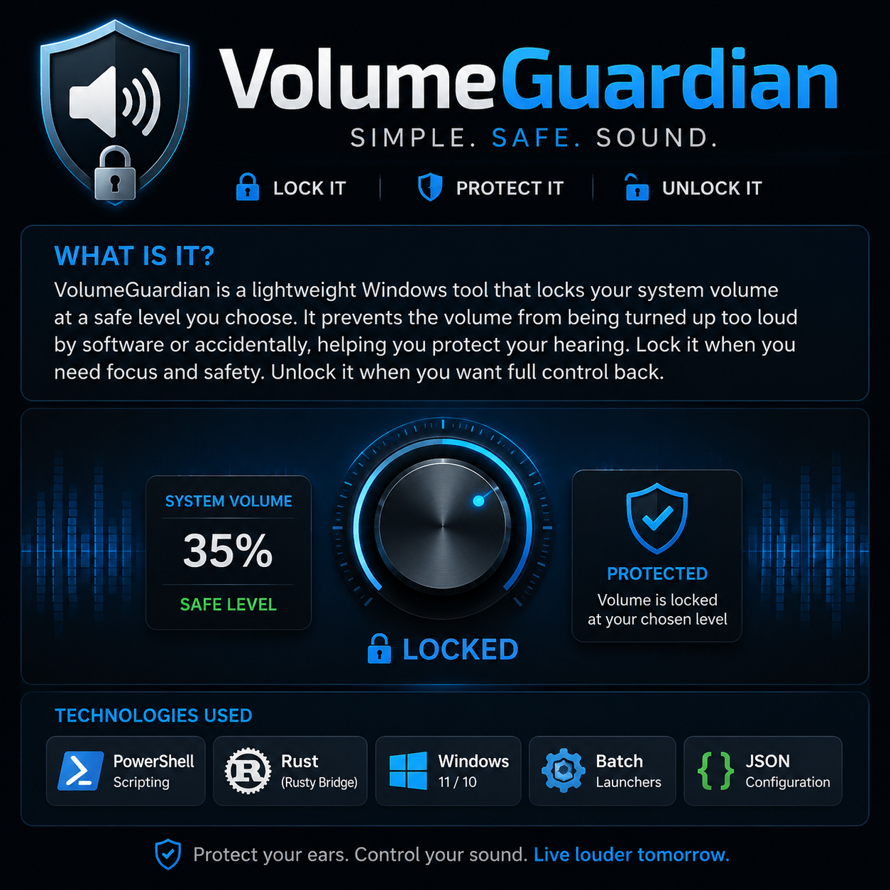

# 🔊 VolumeGuardian

<p align="center">
  
</p>

> **Protect your hearing by locking your Windows volume at a safe level you choose.**

**VolumeGuardian** is a lightweight Windows utility that locks your Windows master volume at a level you decide is safe. Once locked, software and accidental changes cannot increase the Windows volume above that limit until you choose to unlock it.

Instead of relying on willpower alone, VolumeGuardian helps reinforce healthy listening habits while still allowing you to control your physical speakers or amplifier.

---

## 🛠 Technologies


---

# ✨ Features

- Lock Windows volume at the current safe level.
- Prevent accidental or software-driven volume increases.
- Unlock at any time when you want full control back.
- Lightweight background PowerShell guard.
- Simple one-click BAT launchers.
- Logging for lock and unlock events.
- Modular project structure for easy maintenance.
- **Rusty** backend placeholder for future enhancements.

---

# 📁 Project Structure

```text
VolumeGuardian-by-TCDOVERLORD/
│
├── assets/
│   └── volumeupguardian_banner.png
├── docs/
├── launchers/
├── logs/
├── runtime/
├── rusty/
├── scripts/
├── .gitignore
├── README.md
└── setup.ps1
```

---

# 🚀 Getting Started

1. Clone or download the repository.
2. Open PowerShell.
3. Run:

```powershell
.\setup.ps1
```

4. Set Windows volume to your preferred safe maximum.
5. Run:

```text
launchers\LOCK_VOLUME.bat
```

To restore normal control:

```text
launchers\UNLOCK_VOLUME.bat
```

---

# 🦀 Rusty

**Rusty** is the future backend bridge for VolumeGuardian.

In Version 1, Rusty does not control Windows or modify audio. It exists as a clean, modular connection point for future backend functionality while keeping VolumeGuardian focused on a single purpose.

---

# 🎯 Project Philosophy

This project does one thing, and it does it well.

VolumeGuardian exists to help protect your hearing by enforcing the safe volume limit **you** choose.

You remain in control.
VolumeGuardian simply protects the decision you've already made.

---

## 👨‍💻 Developed By

**TCDOVERLORD**

> *"If I have to do it twice... I build a system."*

---

# License

VolumeGuardian is released under a custom **Personal Use and Contribution License**.

Personal use is allowed.

Contributions to the project are welcome.

Business, commercial, enterprise, hosted, cloud, managed-service, resale, or paid use requires written contract permission from **TCDOVERLORD**.

See [LICENSE.md](LICENSE.md) for full terms.

